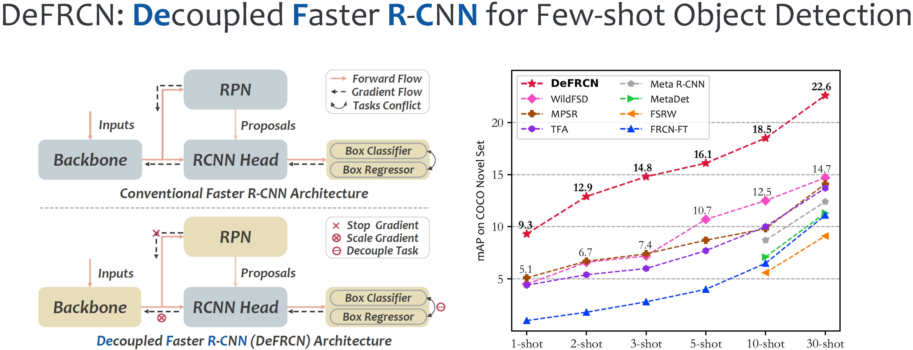
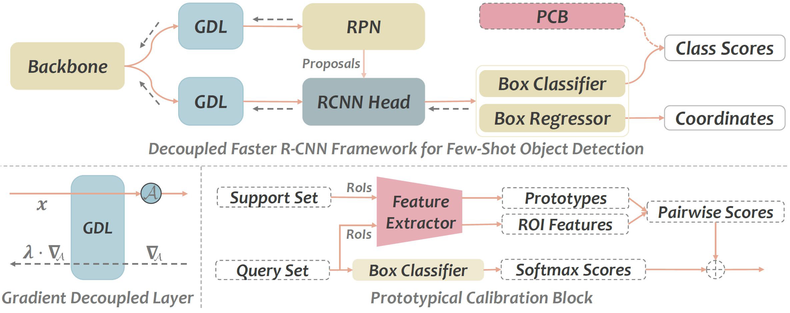

<div align="center"></div>

## Introduction

This repo contains the official PyTorch implementation of our ICCV paper
[DeFRCN: Decoupled Faster R-CNN for Few-Shot Object Detection](https://arxiv.org/abs/2108.09017).

<div align="center"></div>

## Updates!!
* 【2021/10/10】 We release the official PyTorch implementation of [DeFRCN](https://github.com/er-muyue/DeFRCN).
* 【2021/08/20】 We have uploaded our paper (long version with supplementary material) on [arxiv](https://arxiv.org/abs/2108.09017), review it for more details.

## Quick Start

**1. Check Requirements**
* Linux with Python >= 3.6
* [PyTorch](https://pytorch.org/get-started/locally/) >= 1.6 & [torchvision](https://github.com/pytorch/vision/) that matches the PyTorch version.
* CUDA 10.1, 10.2
* GCC >= 4.9

**2. Build DeFRCN**
* Clone Code
  ```angular2html
  git clone https://github.com/er-muyue/DeFRCN.git
  cd DeFRCN
  ```
* Create a virtual environment (optional)
  ```angular2html
  virtualenv defrcn
  cd /path/to/venv/defrcn
  source ./bin/activate
  ```
* Install PyTorch 1.6.0 with CUDA 10.1 
  ```shell
  pip3 install torch==1.6.0+cu101 torchvision==0.7.0+cu101 -f https://download.pytorch.org/whl/torch_stable.html
  ```
* Install Detectron2
  ```angular2html
  python3 -m pip install detectron2==0.3 -f https://dl.fbaipublicfiles.com/detectron2/wheels/cu101/torch1.6/index.html
  ```
  - If you use other version of PyTorch/CUDA, check the latest version of Detectron2 in this page: [Detectron2](https://github.com/facebookresearch/detectron2/releases). 
  - Sorry for that I don’t have enough time to test on more versions, if you run into problems with other versions, please let me know.
* Install other requirements. 
  ```angular2html
  python3 -m pip install -r requirements.txt
  ```

**3. Prepare Data and Weights**
* Data Preparation
  - We evaluate our models on two datasets for both FSOD and G-FSOD settings:

    | Dataset | Size | GoogleDrive | BaiduYun | Note |
    |:---:|:---:|:---:|:---:|:---:|
    |VOC2007| 0.8G |[download](https://drive.google.com/file/d/1BcuJ9j9Mtymp56qGSOfYxlXN4uEVyxFm/view?usp=sharing)|[download](https://pan.baidu.com/s/1kjAmHY5JKDoG0L65T3dK9g)| - |
    |VOC2012| 3.5G |[download](https://drive.google.com/file/d/1NjztPltqm-Z-pG94a6PiPVP4BgD8Sz1H/view?usp=sharing)|[download](https://pan.baidu.com/s/1DUJT85AG_fqP9NRPhnwU2Q)| - |
    |vocsplit| <1M |[download](https://drive.google.com/file/d/1BpDDqJ0p-fQAFN_pthn2gqiK5nWGJ-1a/view?usp=sharing)|[download](https://pan.baidu.com/s/1518_egXZoJNhqH4KRDQvfw)| refer from [TFA](https://github.com/ucbdrive/few-shot-object-detection#models) |
    |COCO| ~19G | - | - | download from [offical](https://cocodataset.org/#download)|
    |cocosplit| 174M |[download](https://drive.google.com/file/d/1T_cYLxNqYlbnFNJt8IVvT7ZkWb5c0esj/view?usp=sharing)|[download](https://pan.baidu.com/s/1NELvshrbkpRS8BiuBIr5gA)| refer from [TFA](https://github.com/ucbdrive/few-shot-object-detection#models) |
  - Unzip the downloaded data-source to `datasets` and put it into your project directory:
    ```angular2html
      ...
      datasets
        | -- coco (trainval2014/*.jpg, val2014/*.jpg, annotations/*.json)
        | -- cocosplit
        | -- VOC2007
        | -- VOC2012
        | -- vocsplit
      defrcn
      tools
      ...
    ```
* Weights Preparation
  - We use the imagenet pretrain weights to initialize our model. Download the same models from here: [GoogleDrive](https://drive.google.com/file/d/1rsE20_fSkYeIhFaNU04rBfEDkMENLibj/view?usp=sharing) [BaiduYun](https://pan.baidu.com/s/1IfxFq15LVUI3iIMGFT8slw)
  - The extract code for all BaiduYun link is **0000**

**4. Training and Evaluation**

For ease of training and evaluation over multiple runs, we integrate the whole pipeline of few-shot object detection into one script `run_*.sh`, including base pre-training and novel-finetuning (both FSOD and G-FSOD).
* To reproduce the results on VOC, `EXP_NAME` can be any string (e.g defrcn, or something) and `SPLIT_ID` must be `1 or 2 or 3` (we consider 3 random splits like other papers).
  ```angular2html
  bash run_voc.sh EXP_NAME SPLIT_ID (1, 2 or 3)
  ```
* To reproduce the results on COCO, `EXP_NAME` can be any string (e.g defrcn, or something) 
  ```angular2html
  bash run_coco.sh EXP_NAME
  ```
* Please read the details of few-shot object detection pipeline in `run_*.sh`, you need change `IMAGENET_PRETRAIN*` to your path.

### Dual-Fusion Ablations (Base -> Fine-tuning)

This repo now includes a folderized ablation matrix under:

```text
configs/coco/dualFusionAblations/
configs/voc/dualFusionAblations/
```

Each folder is one ablation setting (`baseline`, `norefine`, `roi_res5`, `origweights`, `rpn_no_res5`, `roi_res4_only`, `light512`, `lr_0p005`, `lr_0p0025`) and contains both base-stage and shot-stage configs.

What each dual-fusion ablation tests:

| Ablation folder | Main change vs `baseline` | What it tests |
|---|---|---|
| `baseline` | `USE_REFINE=True`, `ALIGN_CHANNELS=1024`, branch-biased init (`RPN=[2.0,1.5,0.5]`, `ROI=[2.0,1.5,-3.0]`), `RPN_LEVELS=[res3,res4,res5]`, `ROI_LEVELS=[res3,res4]` | Default dual-fusion setting |
| `norefine` | `USE_REFINE=False` | Effect of removing post-fusion 3x3 refinement |
| `roi_res5` | `ROI_LEVELS=[res3,res4,res5]`, `ROI_INIT_LOGITS=[2.0,1.5,0.5]` | Effect of adding `res5` into ROI fusion |
| `origweights` | `RPN_INIT_LOGITS=[2,1,0]`, `ROI_INIT_LOGITS=[0,1,2]`, both branches use `res3/res4/res5` | Original semantic-bias weighting variant |
| `rpn_no_res5` | `RPN_LEVELS=[res3,res4]` (drops `res5`) | How much RPN depends on high-level `res5` input |
| `roi_res4_only` | `ROI_LEVELS=[res4]` | ROI classification/regression with only `res4` |
| `light512` | `ALIGN_CHANNELS=512` | Lighter neck capacity / compute |
| `lr_0p005` | `SOLVER.BASE_LR=0.005` | LR sensitivity (milder update) |
| `lr_0p0025` | `SOLVER.BASE_LR=0.0025` | LR sensitivity (more conservative update) |

Use `run_dual_fusion_ablations.sh` for end-to-end runs:

```bash
bash run_dual_fusion_ablations.sh \
  --dataset coco \
  --exp-name df_coco_baseline \
  --ablation baseline \
  --imagenet-pretrain /data/.pretrain_weights/ImageNetPretrained/MSRA/R-101.pkl \
  --imagenet-pretrain-torch /data/.pretrain_weights/ImageNetPretrained/torchvision/resnet101-5d3b4d8f.pth \
  --setting both \
  --shots "1 2 3 5 10 30" \
  --seeds "0"
```

VOC example:

```bash
bash run_dual_fusion_ablations.sh \
  --dataset voc \
  --split-id 1 \
  --exp-name df_voc_s1 \
  --ablation lr_0p005 \
  --imagenet-pretrain /data/.pretrain_weights/ImageNetPretrained/MSRA/R-101.pkl \
  --imagenet-pretrain-torch /data/.pretrain_weights/ImageNetPretrained/torchvision/resnet101-5d3b4d8f.pth \
  --setting fsod \
  --shots "1 2 3 5 10" \
  --seeds "0 1 2 3 4 5 6 7 8 9"
```

Run all ablations (COCO):

```bash
for abl in baseline norefine roi_res5 origweights rpn_no_res5 roi_res4_only light512 lr_0p005 lr_0p0025; do
  bash run_dual_fusion_ablations.sh \
    --dataset coco \
    --exp-name df_coco_all \
    --ablation "${abl}" \
    --imagenet-pretrain /data/.pretrain_weights/ImageNetPretrained/MSRA/R-101.pkl \
    --imagenet-pretrain-torch /data/.pretrain_weights/ImageNetPretrained/torchvision/resnet101-5d3b4d8f.pth \
    --setting both \
    --shots "1 2 3 5 10 30" \
    --seeds "0"
done
```

What this script does:

1. Base pre-training with the selected ablation base config.
2. Model surgery (`remove` for FSOD and `randinit` for GFSOD).
3. Novel fine-tuning for selected shots and seeds.
4. Result summary generation via `tools/extract_results.py`.

Important notes:

1. It generates seed-specific temporary configs under `/tmp` and does not modify your config files.
2. `--skip-base` can be used to reuse an existing base checkpoint in the same output directory.
3. Results are saved under `checkpoints/<dataset>/<exp-name>/<ablation>/`.

### Adapter Ablations (Vanilla Forward Decoupling)

This repo also includes adapter-based forward-decoupling ablations under:

```text
configs/coco/adapterAblations/
configs/voc/adapterAblations/
```

Each folder contains full base-stage and shot-stage configs:
`baseline`, `off`, `shared`, `no_gate`, `gate_init1`, `light`, `heavy`, `ln`, `rpn_only`, `roi_only`.

What each adapter ablation tests:

| Ablation folder | Main change vs `baseline` | What it tests |
|---|---|---|
| `baseline` | Enable branch adapters on `res4` for both RPN and ROI, separate adapters, `GN`, `BOTTLENECK_RATIO=0.25`, gated residual with `GATE_INIT=0.0` | Default adapter decoupling |
| `off` | `BRANCH_ADAPTER.ENABLE=False` | No forward adapter (control) |
| `shared` | `SHARED=True` | Shared adapter weights across RPN and ROI branches |
| `no_gate` | `USE_GATE=False` | Residual adapter without learnable gate |
| `gate_init1` | `GATE_INIT=1.0` | Full-strength adapter from start vs identity-start |
| `light` | `BOTTLENECK_RATIO=0.125` | Lower adapter capacity |
| `heavy` | `BOTTLENECK_RATIO=0.5` | Higher adapter capacity |
| `ln` | `NORM="LN"` | Normalization choice (`LN` vs `GN`) |
| `rpn_only` | `ROI_FEATURES=[]` | Adapt only proposal branch |
| `roi_only` | `RPN_FEATURES=[]` | Adapt only ROI branch |

Use `run_adapter_ablations.sh` for end-to-end runs:

```bash
bash run_adapter_ablations.sh \
  --dataset coco \
  --exp-name adapter_coco_baseline \
  --ablation baseline \
  --imagenet-pretrain /data/.pretrain_weights/ImageNetPretrained/MSRA/R-101.pkl \
  --imagenet-pretrain-torch /data/.pretrain_weights/ImageNetPretrained/torchvision/resnet101-5d3b4d8f.pth \
  --setting both \
  --shots "1 2 3 5 10 30" \
  --seeds "0"
```

VOC example:

```bash
bash run_adapter_ablations.sh \
  --dataset voc \
  --split-id 1 \
  --exp-name adapter_voc_s1 \
  --ablation light \
  --imagenet-pretrain /data/.pretrain_weights/ImageNetPretrained/MSRA/R-101.pkl \
  --imagenet-pretrain-torch /data/.pretrain_weights/ImageNetPretrained/torchvision/resnet101-5d3b4d8f.pth \
  --setting fsod \
  --shots "1 2 3 5 10" \
  --seeds "0 1 2 3 4 5 6 7 8 9"
```

Run all adapter ablations (COCO):

```bash
for abl in baseline off shared no_gate gate_init1 light heavy ln rpn_only roi_only; do
  bash run_adapter_ablations.sh \
    --dataset coco \
    --exp-name adapter_coco_all \
    --ablation "${abl}" \
    --imagenet-pretrain /data/.pretrain_weights/ImageNetPretrained/MSRA/R-101.pkl \
    --imagenet-pretrain-torch /data/.pretrain_weights/ImageNetPretrained/torchvision/resnet101-5d3b4d8f.pth \
    --setting both \
    --shots "1 2 3 5 10 30" \
    --seeds "0"
done
```

What this script does:

1. Base pre-training with the selected adapter ablation base config.
2. Model surgery (`remove` for FSOD and `randinit` for GFSOD).
3. Novel fine-tuning for selected shots and seeds.
4. Result summary generation via `tools/extract_results.py`.

Important notes:

1. It generates seed-specific temporary configs under `/tmp` and does not modify your config files.
2. `--skip-base` can be used to reuse an existing base checkpoint in the same output directory.
3. Results are saved under `checkpoints/<dataset>/<exp-name>/<ablation>/`.

### VAE-FSOD (Norm + Quality-Conditioned Variant)

Implemented methods:

1. Norm-VAE (paper-style): *Generating Features with Increased Crop-related Diversity for Few-Shot Object Detection*.
2. Quality-conditioned VAE (modular extension): condition on proposal-quality vector
   (`iou`, `fg_ratio`, `gt_coverage`, `center_offset`, `crowding`) with
   easy/medium/hard quality-bin sampling and a quality consistency head.

Config folders:

```text
configs/coco/vaeFsod/
configs/voc/vaeFsod/
configs/coco/qualityVaeFsod/
configs/voc/qualityVaeFsod/
```

Config intent:

1. Base-stage configs (`defrcn_det_r101_base*_vaefsod.yaml`) keep VAE disabled.
2. FSOD-stage configs (`defrcn_fsod_*_vaefsod.yaml`) enable VAE auxiliary classification with generated feature bank.
3. Quality-stage configs are organized by ablation folder under `qualityVaeFsod/`.
4. `qualityVaeFsod/baseline/` contains the original quality-VAE configs (moved from root).
5. VAE paper settings are encoded in `MODEL.VAE_FSOD.*`:
   - latent/semantic dims = `512`,
   - encoder hidden = `4096` (3 FC encoder),
   - decoder hidden = `4096` (2 FC decoder),
   - IoU-to-norm mapping range uses `sqrt(d)` to `5*sqrt(d)`,
   - generated features per class = `30`,
   - beta interval = `0.75`.

Quality-VAE ablations (both COCO and VOC have full base + shot config sets):

| Ablation folder | Main change vs `baseline` | What it tests |
|---|---|---|
| `baseline` | `KEYS=[iou, fg_ratio, gt_coverage, center_offset, crowding]`, `AUX_LOSS_WEIGHT=0.2`, `BIN_QUANTILES=[0.33,0.66]`, `GEN_BIN_RATIOS=[0.34,0.33,0.33]` | Default quality-conditioned VAE |
| `iou_only` | `KEYS=[iou]`, `HARDNESS_WEIGHTS=[1.0]` | Whether multi-factor quality is better than IoU-only conditioning |
| `no_qaux` | `QUALITY.AUX_LOSS_WEIGHT=0.0` | Effect of quality consistency head/loss |
| `no_crowding` | Remove `crowding` from `KEYS` and weights | Value of explicit crowding/nearby-instance signal |
| `center_heavy` | `HARDNESS_WEIGHTS=[0.5,0.5,0.5,2.0,0.5]` | Emphasizing center misalignment in hardness definition |
| `hard_bias` | `GEN_BIN_RATIOS=[0.20,0.30,0.50]` | More hard-sample generation during synthetic feature creation |
| `easy_bias` | `GEN_BIN_RATIOS=[0.50,0.30,0.20]` | More easy-sample generation (control against hard-bias) |
| `wide_bins` | `BIN_QUANTILES=[0.25,0.75]` | Sharper easy/medium/hard partitioning |

End-to-end runner (Norm-VAE default):

```bash
bash run_vae_fsod.sh \
  --dataset coco \
  --exp-name vaefsod_coco \
  --imagenet-pretrain /data/.pretrain_weights/ImageNetPretrained/MSRA/R-101.pkl \
  --imagenet-pretrain-torch /data/.pretrain_weights/ImageNetPretrained/torchvision/resnet101-5d3b4d8f.pth \
  --shots "1 2 3 5 10 30" \
  --seeds "0"
```

VOC example:

```bash
bash run_vae_fsod.sh \
  --dataset voc \
  --split-id 1 \
  --exp-name vaefsod_voc_s1 \
  --imagenet-pretrain /data/.pretrain_weights/ImageNetPretrained/MSRA/R-101.pkl \
  --imagenet-pretrain-torch /data/.pretrain_weights/ImageNetPretrained/torchvision/resnet101-5d3b4d8f.pth \
  --shots "1 2 3 5 10" \
  --seeds "0 1 2 3 4 5 6 7 8 9"
```

Quality-conditioned variant example:

```bash
bash run_vae_fsod.sh \
  --dataset coco \
  --variant quality \
  --ablation baseline \
  --exp-name qvaefsod_coco \
  --imagenet-pretrain /data/.pretrain_weights/ImageNetPretrained/MSRA/R-101.pkl \
  --imagenet-pretrain-torch /data/.pretrain_weights/ImageNetPretrained/torchvision/resnet101-5d3b4d8f.pth \
  --shots "1 2 3 5 10 30" \
  --seeds "0"
```

Run all quality-VAE ablations (COCO):

```bash
bash run_quality_vae_ablations.sh \
  --dataset coco \
  --exp-name qvaefsod_coco_all \
  --imagenet-pretrain /data/.pretrain_weights/ImageNetPretrained/MSRA/R-101.pkl \
  --imagenet-pretrain-torch /data/.pretrain_weights/ImageNetPretrained/torchvision/resnet101-5d3b4d8f.pth \
  --shots "1 2 3 5 10 30" \
  --seeds "0"
```

Run selected quality ablations only:

```bash
bash run_quality_vae_ablations.sh \
  --dataset voc \
  --split-id 1 \
  --exp-name qvaefsod_voc_subset \
  --imagenet-pretrain /data/.pretrain_weights/ImageNetPretrained/MSRA/R-101.pkl \
  --imagenet-pretrain-torch /data/.pretrain_weights/ImageNetPretrained/torchvision/resnet101-5d3b4d8f.pth \
  --ablations "baseline iou_only no_qaux" \
  --shots "1 2 3 5 10" \
  --seeds "0 1 2 3 4 5 6 7 8 9"
```

What `run_vae_fsod.sh` does:

1. Base pre-training with the selected variant base config (`vaeFsod` or `qualityVaeFsod/<ablation>`).
2. Model surgery (`remove`) for FSOD fine-tuning initialization.
3. Train VAE on base-set RoI features (`tools/train_vae_fsod.py`):
   - `--variant norm`: paper-style Norm-VAE.
   - `--variant quality --ablation <name>`: quality-conditioned VAE with selected ablation configs.
4. For each shot/seed:
   - generate a shot/seed FSOD config,
   - generate class-conditional synthetic feature bank (`tools/generate_vae_fsod_features.py`),
   - fine-tune DeFRCN with VAE auxiliary classification loss.
5. Summarize results via `tools/extract_results.py`.
6. `run_quality_vae_ablations.sh` wraps step 1-5 and loops over quality ablation folders.

Outputs are written to:

```text
checkpoints/<dataset>/<exp-name>/vaeFsod/
checkpoints/<dataset>/<exp-name>/qualityVaeFsod/<ablation>/
```

### Quantifying Proposal Bottleneck Gap (Vanilla DeFRCN)

Use `tools/quantify_proposal_gap.py` to measure how much performance is capped by proposal quality.

Example:

```bash
conda run -n defrcn-env bash -lc '
cd /path/to/DeFRCN
PYTHONPATH=$PWD python tools/quantify_proposal_gap.py \
  --config-file configs/coco/defrcn_fsod_r101_novel_10shot_seedx.yaml \
  --weights /path/to/model_final.pth \
  --device cuda \
  --topk 100,300,1000 \
  --ious 0.5,0.75 \
  --ap50 18.4 \
  --output-json outputs/proposal_gap.json
'
```

What it computes:

1. `Recall@K,IoU`: fraction of GT boxes covered by top-K proposals at IoU threshold.
2. `MissGap = 1 - Recall`: direct proposal miss bottleneck.
3. `APCeiling = 100 * Recall`: upper-bound proxy assuming perfect downstream classification/regression over proposed regions.
4. Size-wise recall (`small`, `medium`, `large`).
5. Per-class recall at `max(K)` and IoU `0.50` (or first IoU in `--ious` if `0.50` is absent).

How to interpret:

1. Proposal bottleneck (hard limit proxy) at IoU=0.50: `100 - APCeiling`.
2. If `--ap50` is provided, script reports headroom: `APCeiling - AP50`.
3. Large size-wise/per-class gaps indicate where RPN misses are concentrated.

CLI arguments:

1. `--config-file`: model config path.
2. `--weights`: checkpoint path.
3. `--dataset`: optional override for `cfg.DATASETS.TEST[0]`.
4. `--topk`: comma-separated proposal budgets (default `100,300,1000`).
5. `--ious`: comma-separated IoU thresholds (default `0.5,0.75`).
6. `--max-images`: optional quick run limit.
7. `--ap50`: optional observed AP50 for headroom reporting.
8. `--output-json`: optional json dump of all summary rows.

JSON output includes:

1. Global summary (`total_images`, `total_gt`, `avg_proposals_per_image`).
2. `summary`: recall/miss-gap/ceiling rows for all `(topk, iou)` pairs.
3. `size_rows`: per-size recall rows.
4. `class_rows`: per-class recall rows.

## Results on COCO Benchmark

* Few-shot Object Detection

  |Method| | | mAP<sup>novel</sup> | | | |
  |:---:|:---:|:---:|:---:|:---:|:---:|:---:|
  | Shot |  1  |  2  |  3  |  5  |  10 |  30 |
  |[FRCN-ft](https://arxiv.org/abs/1506.01497)|1.0*|1.8*|2.8*|4.0*|6.5|11.1|
  |[FSRW](https://openaccess.thecvf.com/content_ICCV_2019/papers/Kang_Few-Shot_Object_Detection_via_Feature_Reweighting_ICCV_2019_paper.pdf)|-|-|-|-|5.6|9.1|
  |[MetaDet](https://openaccess.thecvf.com/content_ICCV_2019/papers/Wang_Meta-Learning_to_Detect_Rare_Objects_ICCV_2019_paper.pdf)|-|-|-|-|7.1|11.3|
  |[MetaR-CNN](https://openaccess.thecvf.com/content_ICCV_2019/papers/Yan_Meta_R-CNN_Towards_General_Solver_for_Instance-Level_Low-Shot_Learning_ICCV_2019_paper.pdf)|-|-|-|-|8.7|12.4|
  |[TFA](http://proceedings.mlr.press/v119/wang20j/wang20j.pdf)|4.4*|5.4*|6.0*|7.7*|10.0|13.7|
  |[MPSR](https://arxiv.org/abs/2007.09384)|5.1*|6.7*|7.4*|8.7*|9.8|14.1|
  |[FSDetView](https://www.ecva.net/papers/eccv_2020/papers_ECCV/papers/123620188.pdf)|4.5|6.6|7.2|10.7|12.5|14.7|
  |[DeFRCN](https://arxiv.org/abs/2108.09017) (Our Paper)|**9.3**|**12.9**|**14.8**|**16.1**|**18.5**|**22.6**|
  |[DeFRCN](https://arxiv.org/abs/2108.09017) (This Repo) |**9.7**|**13.1**|**14.5**|**15.6**|**18.4**|**22.6**|
  
* Generalized Few-shot Object Detection

  |Method| | | mAP<sup>novel</sup>| | | |
  |:---:|:---:|:---:|:---:|:---:|:---:|:---:|
  | Shot |  1  |  2  |  3  |  5  |  10 |  30 |
  |[FRCN-ft](https://arxiv.org/abs/1506.01497)|1.7|3.1|3.7|4.6|5.5|7.4|
  |[TFA](http://proceedings.mlr.press/v119/wang20j/wang20j.pdf)|1.9|3.9|5.1|7|9.1|12.1|
  |[FSDetView](https://www.ecva.net/papers/eccv_2020/papers_ECCV/papers/123620188.pdf)|3.2|4.9|6.7|8.1|10.7|15.9|
  |[DeFRCN](https://arxiv.org/abs/2108.09017) (Our Paper)|**4.8**|**8.5**|**10.7**|**13.6**|**16.8**|**21.2**|
  |[DeFRCN](https://arxiv.org/abs/2108.09017) (This Repo) |**4.8**|**8.5**|**10.7**|**13.5**|**16.7**|**21.0**|
  
- \* indicates that the results are reproduced by us with their source code.
- It's normal to observe -0.3~+0.3AP noise between your results and this repo. 
- The results of mAP<sup>base</sup> and mAP<sup>all</sup> for G-FSOD are list here [GoogleDrive](https://drive.google.com/file/d/1WUM2X-pPzox2fQz4aLi3YzxGgscpnoHU/view?usp=sharing), [BaiduYun](https://pan.baidu.com/s/1XsSa7vxKDWZzSbPU-s0aiA).  
- If you have any problem of above results in this repo, you can download *configs and train logs* from [GoogleDrive](https://drive.google.com/file/d/1WUM2X-pPzox2fQz4aLi3YzxGgscpnoHU/view?usp=sharing), [BaiduYun](https://pan.baidu.com/s/1XsSa7vxKDWZzSbPU-s0aiA).

## Results on VOC Benchmark

* Few-shot Object Detection
 
  |Method| | |Split-1| | | | |Split-2| | | | |Split-3| | |
  |:----|:----|:----|:----|:----|:----|:----|:----|:----|:----|:----|:----|:----|:----|:----|:----|
  |Shot|1|2|3|5|10|1|2|3|5|10|1|2|3|5|10|
  |[YOLO-ft](https://openaccess.thecvf.com/content_ICCV_2019/papers/Kang_Few-Shot_Object_Detection_via_Feature_Reweighting_ICCV_2019_paper.pdf)|6.6|10.7|12.5|24.8|38.6|12.5|4.2|11.6|16.1|33.9|13.0|15.9|15.0|32.2|38.4|
  |[FRCN-ft](https://arxiv.org/abs/1506.01497)|13.8|19.6|32.8|41.5|45.6|7.9|15.3|26.2|31.6|39.1|9.8|11.3|19.1|35.0|45.1|
  |[FSRW](https://openaccess.thecvf.com/content_ICCV_2019/papers/Kang_Few-Shot_Object_Detection_via_Feature_Reweighting_ICCV_2019_paper.pdf)|14.8|15.5|26.7|33.9|47.2|15.7|15.2|22.7|30.1|40.5|21.3|25.6|28.4|42.8|45.9|
  |[MetaDet](https://openaccess.thecvf.com/content_ICCV_2019/papers/Wang_Meta-Learning_to_Detect_Rare_Objects_ICCV_2019_paper.pdf)|18.9|20.6|30.2|36.8|49.6|21.8|23.1|27.8|31.7|43.0|20.6|23.9|29.4|43.9|44.1|
  |[MetaR-CNN](https://openaccess.thecvf.com/content_ICCV_2019/papers/Yan_Meta_R-CNN_Towards_General_Solver_for_Instance-Level_Low-Shot_Learning_ICCV_2019_paper.pdf)|19.9|25.5|35.0|45.7|51.5|10.4|19.4|29.6|34.8|45.4|14.3|18.2|27.5|41.2|48.1|
  |[TFA](http://proceedings.mlr.press/v119/wang20j/wang20j.pdf)|39.8|36.1|44.7|55.7|56.0|23.5|26.9|34.1|35.1|39.1|30.8|34.8|42.8|49.5|49.8|
  |[MPSR](https://arxiv.org/abs/2007.09384)|41.7|-|51.4|55.2|61.8|24.4|-|39.2|39.9|47.8|35.6|-|42.3|48.0|49.7|
  |[DeFRCN](https://arxiv.org/abs/2108.09017) (Our Paper)|**53.6**|**57.5**|**61.5**|**64.1**|**60.8**|**30.1**|**38.1**|**47.0**|**53.3**|**47.9**|**48.4**|**50.9**|**52.3**|**54.9**|**57.4**|
  |[DeFRCN](https://arxiv.org/abs/2108.09017) (This Repo)|**55.1**|**57.4**|**61.1**|**64.6**|**61.5**|**32.1**|**40.5**|**47.9**|**52.9**|**47.5**|**48.9**|**51.9**|**52.3**|**55.7**|**59.0**|

* Generalized Few-shot Object Detection

  |Method| | |Split-1| | | | |Split-2| | | | |Split-3| | |
  |:----|:----|:----|:----|:----|:----|:----|:----|:----|:----|:----|:----|:----|:----|:----|:----|
  |Shot|1|2|3|5|10|1|2|3|5|10|1|2|3|5|10|
  |[FRCN-ft](https://arxiv.org/abs/1506.01497)|9.9|15.6|21.6|28.0|52.0|9.4|13.8|17.4|21.9|39.7|8.1|13.9|19|23.9|44.6|
  |[FSRW](https://openaccess.thecvf.com/content_ICCV_2019/papers/Kang_Few-Shot_Object_Detection_via_Feature_Reweighting_ICCV_2019_paper.pdf)|14.2|23.6|29.8|36.5|35.6|12.3|19.6|25.1|31.4|29.8|12.5|21.3|26.8|33.8|31.0|
  |[TFA](http://proceedings.mlr.press/v119/wang20j/wang20j.pdf)|25.3|36.4|42.1|47.9|52.8|18.3|27.5|30.9|34.1|39.5|17.9|27.2|34.3|40.8|45.6|
  |[FSDetView](https://www.ecva.net/papers/eccv_2020/papers_ECCV/papers/123620188.pdf)|24.2|35.3|42.2|49.1|57.4|21.6|24.6|31.9|37.0|45.7|21.2|30.0|37.2|43.8|49.6|
  |[DeFRCN](https://arxiv.org/abs/2108.09017) (Our Paper)|**40.2**|**53.6**|**58.2**|**63.6**|**66.5**|**29.5**|**39.7**|**43.4**|**48.1**|**52.8**|**35.0**|**38.3**|**52.9**|**57.7**|**60.8**|
  |[DeFRCN](https://arxiv.org/abs/2108.09017) (This Repo)|**43.8**|**57.5**|**61.4**|**65.3**|**67.0**|**31.5**|**40.9**|**45.6**|**50.1**|**52.9**|**38.2**|**50.9**|**54.1**|**59.2**|**61.9**|

* Note that we change the λ<sup>GDL-RCNN</sup> for VOC to 0.001 (0.01 in paper) and get better performance, check the configs for more details.
* The results of mAP<sup>base</sup> and mAP<sup>all</sup> for G-FSOD are list here [GoogleDrive](https://drive.google.com/file/d/1Ff5jP4PCDDPQ7lzsageZsauFWer73QIl/view?usp=sharing), [BaiduYun](https://pan.baidu.com/s/1FQq_2EgqlmzFv8cANOFYmA).
* If you have any problem of above results in this repo, you can download *configs and logs* from [GoogleDrive](https://drive.google.com/file/d/1Ff5jP4PCDDPQ7lzsageZsauFWer73QIl/view?usp=sharing), [BaiduYun](https://pan.baidu.com/s/1FQq_2EgqlmzFv8cANOFYmA).

## Acknowledgement
This repo is developed based on [TFA](https://github.com/ucbdrive/few-shot-object-detection) and [Detectron2](https://github.com/facebookresearch/detectron2). Please check them for more details and features.

## Citing
If you use this work in your research or wish to refer to the baseline results published here, please use the following BibTeX entries:
```
@inproceedings{qiao2021defrcn,
  title={DeFRCN: Decoupled Faster R-CNN for Few-Shot Object Detection},
  author={Qiao, Limeng and Zhao, Yuxuan and Li, Zhiyuan and Qiu, Xi and Wu, Jianan and Zhang, Chi},
  booktitle={Proceedings of the IEEE/CVF International Conference on Computer Vision},
  pages={8681--8690},
  year={2021}
}
```
